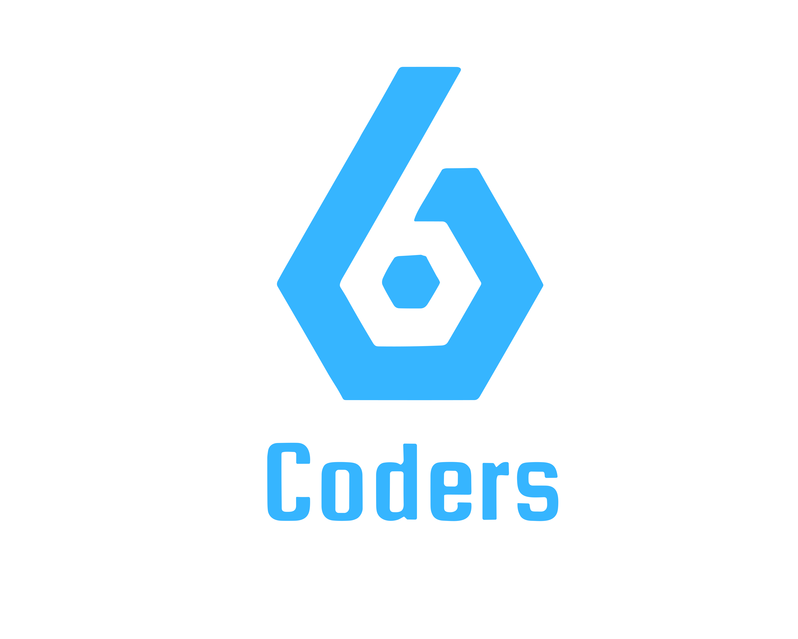

  

# Documentazione 6Coders

**Ingegneria del Software - Gruppo 6Coders - Università degli Studi di Padova - Corso di Laurea in Informatica - A.A.: 2023/2024**

### Struttura della repository

<b>Candidatura</b>

- [Candidatura V1.0](https://github.com/6Coders/6coders.github.io/blob/main/Candidatura/6Coders_Candidatura_1.0.pdf)
- [Dichiarazione degli impegni V2.0](https://github.com/6Coders/6coders.github.io/blob/main/Candidatura/6Coders_DichiarazioneImpegni_2.0.pdf)
- [Valutazione Capitolati V1.0](https://github.com/6Coders/6coders.github.io/blob/main/Candidatura/6Coders_ValutazioneCapitolati_1.0.pdf)
  - Verbali
    - Esterni
      - [Verbale esterno del 27 ottobre 2023](https://github.com/6Coders/6coders.github.io/blob/main/Candidatura/Verbali/Esterni/vEXT_271023.pdf)
    - Interni
      - [Verbale interno del 18 ottobre 2023](https://github.com/6Coders/6coders.github.io/blob/main/Candidatura/Verbali/Interni/vINT_181023.pdf)
      - [Verbale interno del 20 ottobre 2023](https://github.com/6Coders/6coders.github.io/blob/main/Candidatura/Verbali/Interni/vINT_201023.pdf)
      - [Verbale interno del 23 ottobre 2023](https://github.com/6Coders/6coders.github.io/blob/main/Candidatura/Verbali/Interni/vINT_231023.pdf)
      - [Verbale interno del 20 ottobre 2023](https://github.com/6Coders/6coders.github.io/blob/main/Candidatura/Verbali/Interni/vINT_261023.pdf)
      - [Verbale interno del 06 novembre 2023](https://github.com/6Coders/6coders.github.io/blob/main/Candidatura/Verbali/Interni/vINT_061123.pdf)
 

<b>RTB</b>
- Documentazione Esterna
  - [Analisi dei Requisiti V1.0](https://github.com/6Coders/6coders.github.io/blob/main/RTB/DocumentazioneEsterna/6Coders_AnalisiDeiRequisiti_1-0.pdf)
  - [Glossario V1.0](https://github.com/6Coders/6coders.github.io/blob/main/RTB/DocumentazioneEsterna/6Coders_Glossario_1-0.pdf)
  - [Piano di Qualifica V1.0](https://github.com/6Coders/6coders.github.io/blob/main/RTB/DocumentazioneEsterna/6Coders_PianoDiQualifica_1-0.pdf)
  - [Piano di Progetto V1.0](https://github.com/6Coders/6coders.github.io/blob/main/RTB/DocumentazioneEsterna/6Coders_PianoDiProgetto_1-0.pdf)
  - [Lettera di Presentazione RTB - 1 Parte](https://github.com/6Coders/6coders.github.io/blob/main/RTB/DocumentazioneEsterna/6Coders_PresentazioneRTB_1Parte.pdf)
  - [Lettera di Presentazione RTB - 2 Parte](https://github.com/6Coders/6coders.github.io/blob/main/RTB/DocumentazioneEsterna/6Coders_PresentazioneRTB_2Parte.pdf)
- Documentazione Interna
  - [Norme di Progetto V1.0](https://github.com/6Coders/6coders.github.io/blob/main/RTB/DocumentazioneInterna/6Coders_NormeDiProgetto_1-0.pdf)
- Verbali
  - Esterni
    - [Verbale esterno del 17 novembre 2023](https://github.com/6Coders/6coders.github.io/blob/main/RTB/Verbali/Esterni/vEXT_231117.pdf)
    - [Verbale esterno del 15 dicembre 2023](https://github.com/6Coders/6coders.github.io/blob/main/RTB/Verbali/Esterni/vEXT_231215.pdf)
    - [Verbale esterno del 10 gennaio 2024](https://github.com/6Coders/6coders.github.io/blob/main/RTB/Verbali/Esterni/vEXT_240110.pdf)
  - Interni
    - [Verbale interno del 22 novembre 2023](https://github.com/6Coders/6coders.github.io/blob/main/RTB/Verbali/Interni/vINT_231122.pdf)
    - [Verbale interno del 01 dicembre 2023](https://github.com/6Coders/6coders.github.io/blob/main/RTB/Verbali/Interni/vINT_231201.pdf)
    - [Verbale interno del 13 dicembre 2023](https://github.com/6Coders/6coders.github.io/blob/main/RTB/Verbali/Interni/vINT_231213.pdf)
    - [Verbale interno del 18 dicembre 2023](https://github.com/6Coders/6coders.github.io/blob/main/RTB/Verbali/Interni/vINT_231218.pdf)
    - [Verbale interno del 02 gennaio 2024](https://github.com/6Coders/6coders.github.io/blob/main/RTB/Verbali/Interni/vINT_240102.pdf)
    - [verbale interno del 24 gennaio 2024](https://github.com/6Coders/6coders.github.io/blob/main/RTB/Verbali/Interni/vINT_240124.pdf)
    - [Verbale interno del 07 febbraio 2024](https://github.com/6Coders/6coders.github.io/blob/main/RTB/Verbali/Interni/vINT_240207.pdf)
    - [Verbale interno del 01 marzo 2024](https://github.com/6Coders/6coders.github.io/blob/main/RTB/Verbali/Interni/vINT_240301.pdf)
 

 

<b>IMG</b>
- [Logo](https://github.com/6Coders/6coders.github.io/blob/main/img/sei.png)

## Componenti del Gruppo

| Nominativo           |
| --------------------|
| Edoardo Florian      |
| Pietro Marchiorato   |
| Yuri Lovato          |
| Eleonora Bilinski    |
| Vullnet Vogli        |
| Ana Maria Niagu      |
| Osama Chelhaoui      |

E-mail: 6coders.unipd@gmail.com
